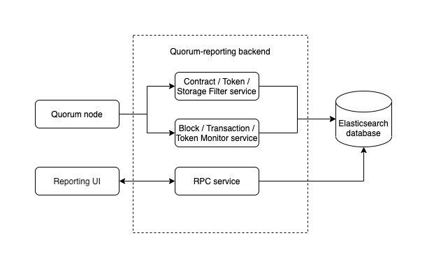

# Quorum Reporting

## Requirements (initial draft)
Number | Area | Requirement 
:---: | :---: | :--- 
1 | Admin | Ability for an admin to register a contract address for monitoring and reporting
2 | Admin | Registration should allow flexibility to monitor <ul><li>Contract events - It should be possible to monitor all or a subset of contract events</li><li>State changes - It should be possible to monitor state change of all or subset of contract attributes </li><li>Internal transactions created as a part of contract execution</li></ul>
3 | Data Fetch | Once a contract is registered for monitoring/reporting, reporting tools should fetch the following historical data from geth <ul><li>Events</li><li>Transactions </li><li>State changes</li></ul>
4 | Data Fetch | For all registered contracts, reporting tool to poll continuously on Quorum geth node for new blocks and if the state of the registered contracts have changed in the new block, it should fetch all applicable data for reporting
5 | Data Fetch | Data fetch should cater for scenarios when the reporting service was restarted and thus the reporting db data is behind the Quorum geth node data.
6 | Data storage | Reporting tool to have its own reporting database with a well defined data schema for easy querying and reporting. The data fetched from Quorum geth node to be stored here
7 | Dashboard and UI | UI for the following activities <ul><li>Registration of contracts for monitoring with ability to select subset of contract events and storage attributes</li><li>UI displaying all contract transactions, related event logs, internal transactions and state changes with drill down capability</ul>

## Approach

Reporting engine is built on top of Quorum 2.6.0 as it supports `graphql` with a flexible querying mechanism

* Fetch Data
   * Reporting engine subscribes to `newChainHead` event of geth node on websocket connection
   * Reporting engine pulls all blocks and transactions from geth node
   * Reporting engine index transactions/ events/ storage based on registered addresses
   * Endpoints used:
      * GraphQL
      * RPC APIs
* Store Data
   * Memory Database (for dev only)
   * Elasticsearch Database
* Parse Data
   * Reporting engine can store contract ABI and parse transaction/ event signature and params based on the ABI information
* Display Data 
   * Dashboard and configuration options to be added on Cakeshop UI for the first version

## Architecture & Design

 

#### Database Schema

Elasticsearch Database Schema [Reference](database/elasticsearch/README.md)

#### RPC API Specification

[Reference](core/rpc/README.md)
